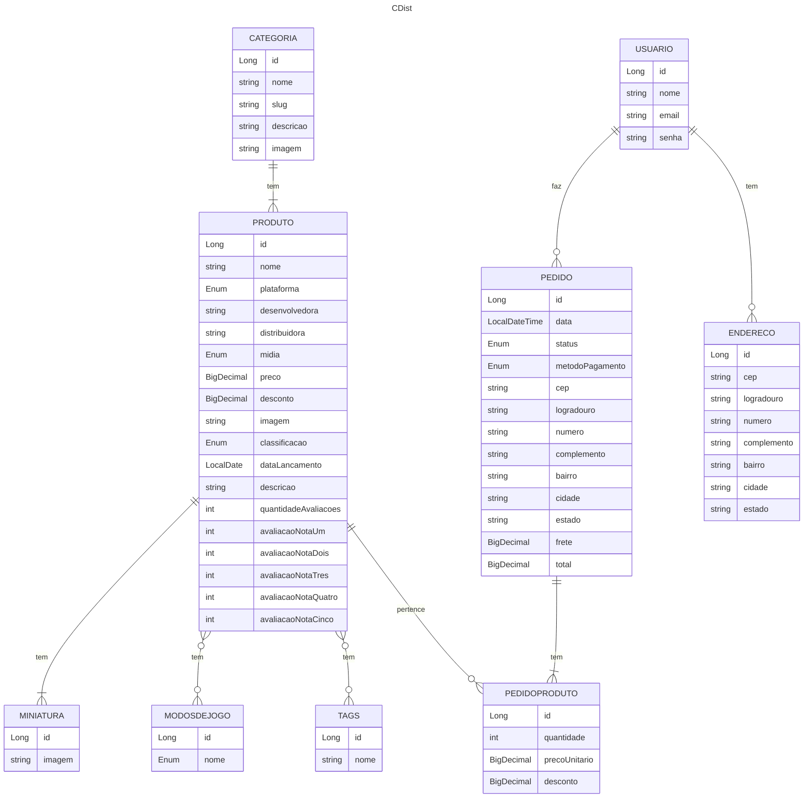

# Modelo de Dados

Status: Finalizado | Última atualização: 06/10/2026 | Responsáveis: Bernardo Lucini e Matheus Henrique Mohr

## 1. Visão geral
O sistema modela os dados e como são salvos as classes do backend da loja de jogos CDist.
O fluxo principal se baseia em o usuário se cadastras/logar, então ele realiza um pedido
adicionando itens ao carringo e clicando em comprar, cadastrando também um endereço.

## 2. Diagrama ER

## 3. Entidades

### 3.1 Categoria
Categoria representa o grupo de plataformas principal do jogo, como por exemplo PlayStation, Xbox, entre outros.

| Campo | Tipo | Obrigatório | Restrições / observações |
|---|---|---|---|
| id | Long | Sim | PK, gerado automaticamente |
| nome | String | Sim | Único |
| slug | String | Sim | Único; minúsculas, sem acentos nem espaços (ex.: `playstation`) |
| descricao | String | Sim | Texto livre |
| imagem | String | Sim | URL |

### 3.2 Produto
Produto representa um jogo à venda na loja. O campo `preco` guarda o **preço cheio** (sem desconto); o `desconto` é aplicado sobre ele no cálculo do valor final (ver seção 5).

| Campo | Tipo | Obrigatório | Restrições / observações |
|---|---|---|---|
| id | Long | Sim | PK, gerado automaticamente |
| categoria | FK → Categoria | Sim | Muitos produtos para uma categoria |
| nome | String | Sim | |
| plataforma | Enum | Sim | |
| desenvolvedora | String | Sim | |
| distribuidora | String | Sim | |
| midia | Enum | Sim | Ex.: física ou digital |
| preco | BigDecimal | Sim | Preço cheio, maior que 0, 2 casas decimais |
| desconto | BigDecimal | Sim | Padrão 0. Valor decimal (0 a 1) |
| imagem | String | Sim | URL |
| classificacao | Enum | Sim | Classificação indicativa |
| dataLancamento | LocalDate | Sim | |
| descricao | String | Sim | Texto longo |
| quantidadeAvaliacoes | int | Sim | Padrão 0 |
| avaliacaoNotaUm ... avaliacaoNotaCinco | int | Sim | Padrão 0; quantidade de avaliações de cada nota (5 colunas) |

### 3.3 Miniatura
Imagens secundárias do produto, exibidas na página de detalhes. **Entra só se sobrar tempo** (não é consumida por endpoint obrigatório da entrega 1).

| Campo | Tipo | Obrigatório | Restrições / observações |
|---|---|---|---|
| id | Long | Sim | PK, gerado automaticamente |
| produto | FK → Produto | Sim | Um produto tem várias miniaturas |
| imagem | String | Sim | URL |

### 3.4 Usuario
Cliente cadastrado na loja. O e-mail é o login.

| Campo | Tipo | Obrigatório | Restrições / observações |
|---|---|---|---|
| id | Long | Sim | PK, gerado automaticamente |
| nome | String | Sim | |
| email | String | Sim | **Único**; validar formato; é o login |
| senha | String | Sim | Guardada como **hash BCrypt** (nunca em texto puro); nunca devolvida nas respostas da API |

Observação: o modelo não tem `perfil`. Todo usuário cadastrado é cliente comum. A autorização da entrega 1 fica em "autenticado ou não" e "só acessa os próprios dados".

### 3.5 Endereco
Endereço de entrega cadastrado pelo usuário. Um usuário pode ter vários.

| Campo | Tipo | Obrigatório | Restrições / observações |
|---|---|---|---|
| id | Long | Sim | PK, gerado automaticamente |
| usuario | FK → Usuario | Sim | Preenchido pelo servidor a partir do token, nunca pelo body |
| cep | String | Sim | Exatamente 8 dígitos, só números |
| logradouro | String | Sim | |
| numero | String | Sim | String para aceitar "s/n" e "12A" |
| complemento | String | Não | |
| bairro | String | Sim | |
| cidade | String | Sim | |
| estado | String | Sim | UF com 2 letras maiúsculas |

### 3.6 Pedido
Compra finalizada por um usuário. Os campos de endereço (`cep` a `estado`) são uma **cópia (snapshot)** do endereço escolhido no momento da compra, então editar ou apagar o endereço depois não altera o pedido. O `total` é sempre calculado pelo servidor.

| Campo | Tipo | Obrigatório | Restrições / observações |
|---|---|---|---|
| id | Long | Sim | PK, gerado automaticamente |
| usuario | FK → Usuario | Sim | Vem do token |
| data | LocalDateTime | Sim | Definida pelo servidor na criação |
| status | Enum | Sim | Valor inicial: Pendente |
| metodoPagamento | Enum | Sim | |
| cep | String | Sim | Snapshot do endereço |
| logradouro | String | Sim | Snapshot |
| numero | String | Sim | Snapshot |
| complemento | String | Não | Snapshot |
| bairro | String | Sim | Snapshot |
| cidade | String | Sim | Snapshot |
| estado | String | Sim | Snapshot, UF com 2 letras |
| frete | BigDecimal | Sim | Padrão 0 (cálculo externo fica para a entrega final) |
| total | BigDecimal | Sim | Calculado pelo servidor: soma dos itens com desconto + frete |

### 3.7 PedidoProduto
Item de um pedido. Guarda `precoUnitario` e `desconto` **copiados do produto no momento da compra** (snapshot), então mudanças futuras no catálogo não alteram pedidos antigos. O subtotal **não é guardado**: é calculado no código a partir de preço, desconto e quantidade.

| Campo | Tipo | Obrigatório | Restrições / observações |
|---|---|---|---|
| id | Long | Sim | PK próprio, sem chave composta |
| pedido | FK → Pedido | Sim | |
| produto | FK → Produto | Sim | |
| quantidade | int | Sim | Mínimo 1 |
| precoUnitario | BigDecimal | Sim | Preço cheio do produto na hora da compra, lido do banco (nunca do cliente) |
| desconto | BigDecimal | Sim | Desconto do produto na hora da compra (mesma unidade de `Produto.desconto`) |

### 3.8 Tags
Rótulos livres para classificar produtos (ex.: "Aventura", "Mundo aberto"). Relação muitos-para-muitos com Produto, via tabela de junção gerada pelo JPA (`@ManyToMany` + `@JoinTable`).

| Campo | Tipo | Obrigatório | Restrições / observações |
|---|---|---|---|
| id | Long | Sim | PK, gerado automaticamente |
| nome | String | Sim | Único |

### 3.9 ModosDeJogo
Modos de jogo disponíveis (ex.:um jogador, multijogador, cooperativo). Relação muitos-para-muitos com Produto, via tabela de junção.

| Campo | Tipo | Obrigatório | Restrições / observações |
|---|---|---|---|
| id | Long | Sim | PK, gerado automaticamente |
| nome | Enum | Sim | Único |

## 4. Enums
| Enum | Valores | Usado em |
|---|---|---|
| StatusPedido | Pendente, Realizado, Em trãnsito, Enviado | Pedido |
| MetodoPagamento | Pix, Boleto, Cartão de Crédito | Pedido |
| Plataforma | PlayStation 1, PlayStation 2, PlayStation 3, PlayStation 4, PlayStation 5, XBox 360, XBox One, XBox Series X, Nintendo Switch, Nintendo Wii U, Mega Drive, Super Nintendo, Nintendo 64 | Produto |
| Midia | Física, Digital | Produto |
| Classificacao | Livre, 10 anos, 12 anos, 14 anos, 16 anos, 18 anos | Produto |

## 5. Regras de negócio que afetam o modelo
- **Desconto:** de 0 a 1, conforme porcentagem (0,5 = 50%)
- **Snapshot:** existe snapshot do preço e do desconto de um item em um pedido, e também existe do endereço no momento do pedido. Isso ocorre para que alterações futuras não gerem inconsistência em pedidos já realizados
- **Status inicial do pedido:** Pendente

## 6. Decisões de modelagem
- Entidades adiadas para a entrega final: TAGSPRODUTO, MODOSDEJOGOPRODUTO, DISTRIBUICAOAVALIACOES
- Estratégia de relacionamentos: LAZY e id próprio no PedidoProduto

## 7. Mapeamento para o código
| Tabela | Classe (pacote `entity`) | Observações JPA |
|---|---|---|
| categoria | Categoria | |
| produto | Produto | |
| miniatura | Miniatura | |
| usuario | Usuario | |
| endereco | Endereco | |
| pedido | Pedido | |
| pedido_produto | PedidoProduto | |
| tags | Tags | |
| modos_de_jogo | ModosDeJogo | |

## 8. Dados de seed (`import.sql`)
Categorias: 4
Produto: 30
Miniatura: 120
Usuario: 2
Endereco: 3
Pedido: 3
PedidoProduto: 10
Tags: 21
Modos de Jogo: 3

## 9. Pendências / dúvidas
- [ ] Tabelas N pra N de tags, modos de jogo e distribuições de avaliação